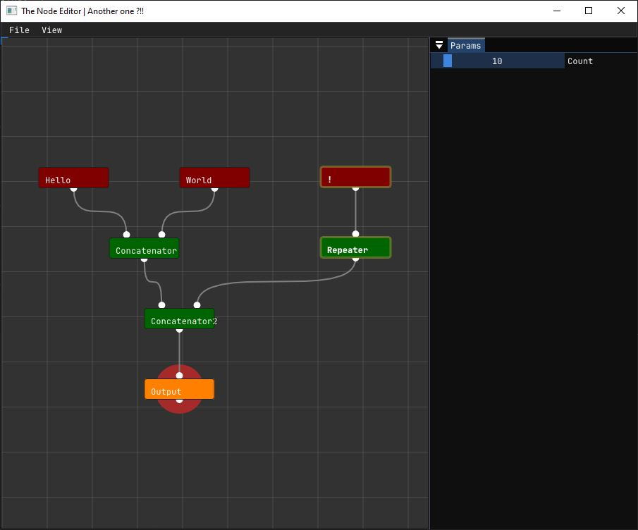

# another imGui Node Editor ... 

Frankly, this is born only from my inability to build [imgui-node-editor](https://github.com/thedmd/imgui-node-editor)
If you are looking for a robust node editor, you should look at [imgui-node-editor](https://github.com/thedmd/imgui-node-editor)

This project is completely dependent on ImGui and GLFW.

Trying to be agnostic regarding the type of data on the Editor side, make the user implementation relatively "involved". You basically have to implement an Application class, some Serialization code too ... .( see [example dir](/example)) I will try to make it easier




```
class StringOperator : public ImGuiNode {
public:
  StringOperator() : ImGuiNode("default") {};
  virtual ~StringOperator() = default;
  virtual void Generate() = 0;

public:
  std::string m_StringCache = "";
};

```
```
template <typename T> 
class Node : public T {
  static_assert(std::is_base_of<StringOperator, T>::value,
                "T must be derived from StringOperator");

public:
  Node(const char *_title) {
    auto node = static_cast<ImGuiNode *>(this);
    node->title = _title;
  }

  void Update() {
    auto node = static_cast<ImGuiNode *>(this);
    auto op = static_cast<StringOperator *>(this);
    for (uint32_t i = 0; i < MAX_N_INPUTS; i++) {
      if (node->GetInput(i) != nullptr) {
        node->GetInput(i)->Update(); /* Important !!*/
        auto opinput = static_cast<StringOperator *>(node->GetInput(i).get());
        op->SetInput(i, node->GetInput(i));
        opinput->Generate();
      }
    }
    op->Generate();
  }

  T *ToOperator() { return static_cast<T *>(this); }
};
```