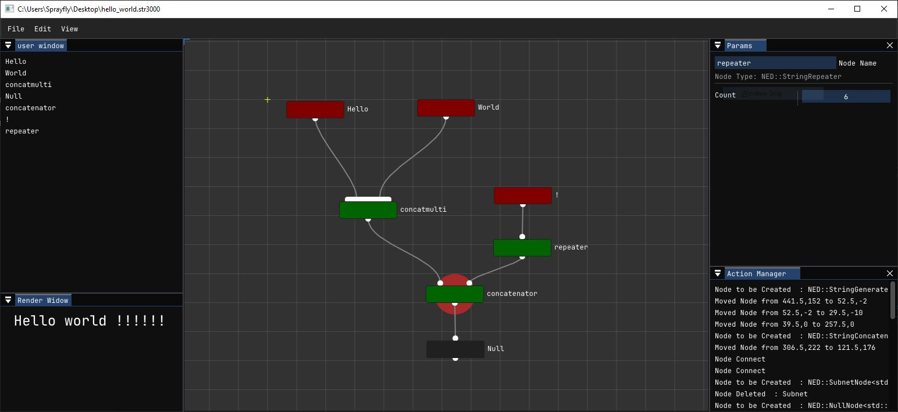

# another imGui Node Editor ... ???

Frankly, this is born only from my inability to build [imgui-node-editor](https://github.com/thedmd/imgui-node-editor)
If you are looking for a robust node editor, you should look at [imgui-node-editor](https://github.com/thedmd/imgui-node-editor)

This project is completely dependent on ImGui and GLFW.

Trying to be agnostic regarding the type of data on the Editor side, makes the user implementation relatively "involved". You basically have to implement an Application class.( see [example dir](/example)) It's already much easier than it was some time ago ...

For now , there is no clever 'network evaluation'. Just a recursive discovery of input nodes, starting from **NodesManager::m_OutputNode** ( the on signaled with a red circle)




An example implementation would look like that :
```cpp
namespace NED{

  class StringOperator : public ImGuiNode<std::string> {
  public:
    StringOperator() : ImGuiNode("default") {};
    virtual ~StringOperator() = default;
    virtual void Generate() = 0;
  };

  class StringGenerate : public StringOperator {
  public:
    StringGenerate(): StringOperator() {
      SetNumAvailableInputs(0);
      str_value_p = CREATE_PARAM(NED::ParamString, "Value", this);
      str_value_p->Set("default value");
    
      m_ParamLayout.params = {str_value_p};
    
    };
    ~StringGenerate() {};

    void Generate() override {
      m_DataCache = str_value_p->Eval();
    }
  public:
    std::shared_ptr<NED::ParamString> str_value_p;
  };
};
```